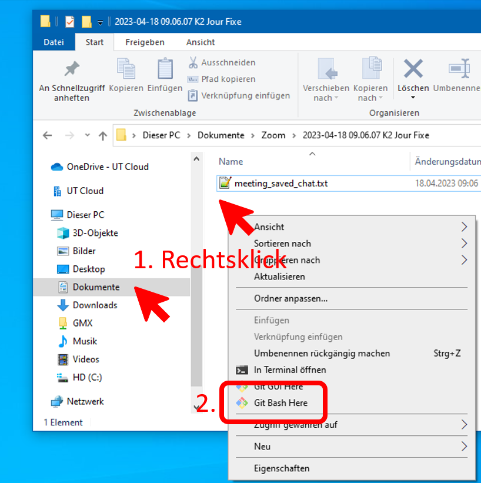

# Navigation in der Kommandozeile

Im Folgenden wollen wir kurz die Navigation in der Kommandozeile und das "Reinschnuppern" in Dateien üben.
Konkret sollen folgende Befehle zum Einsatz kommen:

-   `ls` : *listed die Dateien* des aktuellen Verzeichnisses auf
-   `cd ORDNER` : *wechselt in den Order* "ORDNER" (im aktuellen Verzeichnis)
-   `cd ..` : wechselt in den *ÜBERgeordneten Ordner* (also "wieder raus" aus dem aktuellen Verzeichnis bzw. "eins hoch")
-   `cat DATEI` : zeigt den *Dateiinhalt* an
-   `head DATEI` : zeigt die *ersten Zeilen* einer Datei
-   `tail DATEI` : zeigt die *letzten Zeilen* einer Datei

Zum Üben haben wir ihnen einen kleinen Satz an Verzeichnissen, Unterverzeichnissen und Dateien zusammengestellt, welche wir im Folgenden zunächst herunterladen.

## Schritt 1 - Konsole auf und Datei herunterladen

Dazu öffnen sie zunächst die Konsole in einem Ordner ihrer Wahl.
Entweder mit Hilfe des Kontextmenüs im Explorer (siehe Bild) oder indem sie die Konsole öffnen und in einen Ordner ihrer Wahl navigieren.

[](git-bash-via-context-menu.png)

Anschliessend kopieren wir die Datei aus dem Internet direkt in ihre Verzeichnis, indem wir folgendes Kommando ausführen:

```{bash}
curl.exe https://github.com/Dr-Eberle-Zentrum/DataBASHing/raw/bash-workshop/bash-workshop/browsing.tar.gz -o browsing.tar.gz
```

-   `-o ZIELDATEI` = wo und unter welchem Namen soll der Download gespeichert werden

Das Programm `curl` ist ein Programm zur Navigation und Interaktion mit Internetservern und kann auch verwendet werden (wir hier) um Dateien zu downloaden.
Eigentlich ist für letztere Aufgabe das Programm `wget` geeigneter, welches allerdings in der "Git Bash" nicht direkt zur Verfügung steht.
Daher nehmen wir an dieser Stelle `curl`.

## Schritt 2 - Dateiarchiv auspacken

Nun gilt es herauszufinden, ob der Download geklappt hat und was da so drin ist in der Datei!
Hier verwenden wir einen erste `ls` Aufruf, welche ungefähr folgendes liefern sollte (in einem zuvor leeren Ordner).

```{bash}
$ ls
browsing.tar.gz

```

Dateien mit der Endung `.gz` sind in der Regel mit dem Kompressionsprogramm `gzip` (GNU ZIP) komprimiert.
Dateiendungen mit `.tar` weisen auf die Zusammenführung mehrer Dateien in eine einzelne Archivdatei mit dem Programm `tar` hin.
Also haben wir eine Archivdatei (welche mehrere Dateien und Ordner enthalten kann), welche mit GNU ZIP komprimiert wurde.

Zum Entpacken verwenden wir direkt `tar`:

```{bash}
tar -xzf browsing.tar.gz
# oder äquivalent dazu
tar -x -z -f browsing.tar.gz
```

-   `-x` = bitte Entpacken
-   `-z` = Datei vorher mit GNU ZIP dekomprimieren
-   `-f DATEI` = Archivdatei um die es geht
