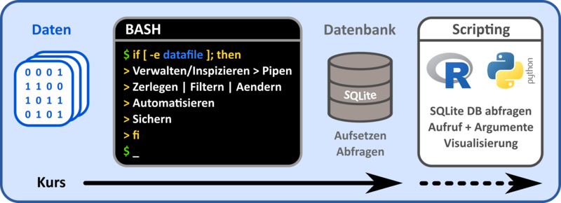

---------------------------------

# Warum die Konsole

Bei der Verarbeitung von grossen Datenmengen oder einer Vielzahl von Dateien stößt man manuell oder ohne geeignete Hilfsmittel schnell an Grenzen der Machbarkeit. Daher hat sich gerade für Prozessierung von Text-Daten die Konsole mit einer Vielzahl von Programmen etabliert.

In der konsolenbasierten Datenverarbeitung versucht man selbige in kleine Einzelschritte zu zergliedern, wie zum Beispiel

-    Teildaten extrahieren
-   Filtern, Sortieren, Arrangieren
-    Umformatieren
-    (De)Komprimieren
-    ...

für die bereits zugeschnittene "kleine" Programme zur Verfügung stehen. Diese können dann in einer Pipe oder einem Skript "in Reihe" geschaltet werden, um den komplexen, individuellen Verarbeitungsprozess mit allgemeinen Bausteinen zusammenzusetzen. Die Konsole bietet darüber hinaus Möglichkeiten diese Workflows zu Verallgemeinern und iterativ auf beliebig viele Daten und Datenmengen anzuwenden.

----------------------------------

# Inhalte des Kurses

Dieser Kurs führt sie in die konsolenbasierte Datenverarbeitung ein. Konkreter werden wir Daten mit der BASH Konsole verarbeiten, diese anschliessend in eine SQLite Datenbank eingepflegen und am Ende diese mit einer Skriptsprache (R oder Python) abgefragen und visualiseren.

Im Folgenden wird der Kursinhalt grafisch zusammengefasst.
Die BASH-basierte Datenverarbeitung als auch der Datenbank-Teil definieren den Hauptteil des Kurses. Der Scripting-Teil dient eher als weiterführender Ausblick, was sie im Anschluss mit den Daten in R oder Python tun können.



Im Kurs implementieren wir dabei Schritt für Schritt einen beispielhaften Anwendungsfall. Ausgehend von einer Webseite, welche Daten in Form einer Tabelle beinhaltet, werden wir aus dieser mittels Kommandozeilenaufrufen die relevanten Informationen extrahieren, manipulieren und formatieren, sodass wir am Ende eine wohlformatierte CSV-Datei der eigentlichen Daten haben. Mit dieser werden wir eine SQLite Datenbank aufsetzen und in der Konsole mit entsprechenden SQL Befehlen abfragen. Zudem schnuppern wir am Ende des Kurses in die Datenbankabfrage mit Python/R und ihrer Visualisierung. Der Ablauf ist im Folgenden grafisch zusammengefasst.


----------------------------------

# Was können sie hinterher?

-    Sicheres bewegen in und verwalten von Datei- und Ordnerstrukturen
-    Schnelle Datentransformation und -aufarbeitung mittels Konsolentools und -pipelines
-    Automatisierung von Arbeitsabläufen und Datenanalysen
-    Überblick über Datenbank-gestützte Datenverwaltung

ggf.

-    Einblick in die skriptbasierte Datenverarbeitung und deren Konsolenaufrufe
    


-------------------------------------------


```{r, include=knitr::is_html_output(), echo=F}
knitr::asis_output(paste('Download: <a href="index.pdf" title="Download PDF Version">PDF Version</a> dieses Tutorials. Erstellt am ',format(Sys.time(), "%d.%m.%Y"),".",sep=""))
```

