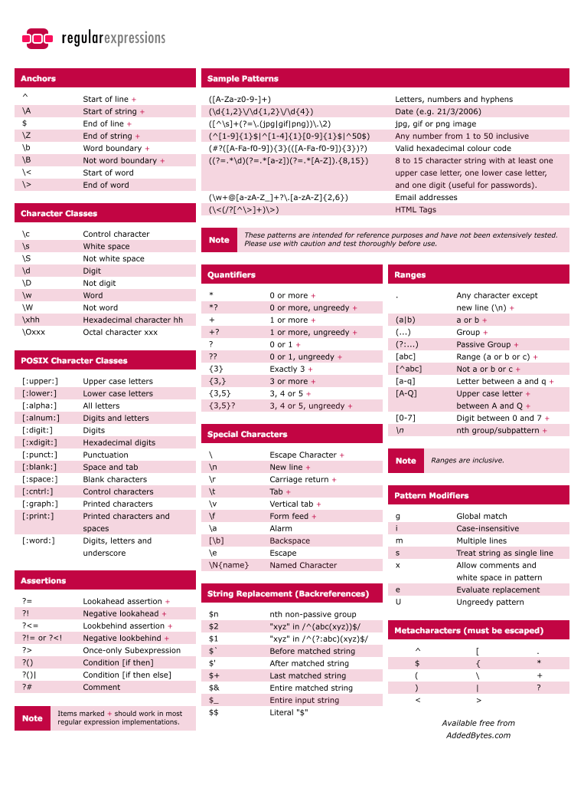

-------------------------------------------

Einführung von 

- [Reguläre Ausdrücke]
- `grep` in [Zeilen filtern]
- `tr, sed`in [Text ersetzen]
- Probleme mit [Zeilenumbrüche]n


Zum Warmwerden gibts die folgenden Videos.

[Video: Bashino - #02: was soll das Ganze & mehr von egrep [5 min]](https://www.youtube.com/watch?v=uDh2RGg0ybo?t=7)

```{r, include=knitr::is_html_output(), echo=F}
knitr::asis_output('<a href="https://www.youtube.com/watch?v=uDh2RGg0ybo?t=7"
                   title="Bashino - #02: was soll das Ganze & mehr von egrep [5 min]"
                   ></a>')
```


[Video: Bashino - #01 cat und egrep [11 min]](https://www.youtube.com/watch?v=nfdVQmS3e_Q?t=7)

```{r, include=knitr::is_html_output(), echo=F}
knitr::asis_output('<a href="https://www.youtube.com/watch?v=nfdVQmS3e_Q?t=7"
                   title="Bashino - #01 cat und egrep [11 min]"
                   ></a>')
```


[Video: Bashino - #10 mit sed suchen und ersetzen [7 min]](https://www.youtube.com/watch?v=wm35zPJOknI?t=7)

```{r, include=knitr::is_html_output(), echo=F}
knitr::asis_output('<a href="https://www.youtube.com/watch?v=wm35zPJOknI?t=7"
                   title="Bashino - #10 mit sed suchen und ersetzen [7 min]"
                   ></a>')
```


Im (optionalen) [Folgevideo #11 Gezieltes Ersetzen mit sed [8 min]](https://youtu.be/LZ4lB10FgiU?t=7) wird noch einmal mehr auf sed und reguläre Ausdrücke eingegangen.


Wer immer noch nicht genug hat, kann sich im [sed Video von Pedagogy (en) [18 min]](https://youtu.be/l7Fpujdp8CQ) noch haufenweise andere "sed magics" anschauen.


-------------------------------------------

# Reguläre Ausdrücke


Reguläre Ausdrücke sind einer der Grundpfeiler für die konsolengestützte Datenprozessierung. Damit kann man automatisiert und/oder mit wenig Aufwand

- **nach** Vorkommen von **Textmustern suchen** (z.B. via `grep`), um
  - nur gesuchte Muster anzeigen
  - alle Zeilen(nummern) anzuzeigen, die das Muster enthalten
  - alle Dateien zu finden, die ein Textmuster beinhalten
- Textblöcke **verändern und ersetzen** (z.B. via `sed`)
 
Dabei ist unter "Textmuster" nicht ein exaktes Wort oder dergleichen zu verstehen, sondern eine Suchkodierung, welche Variabilität zulässt. 

Als Einsteig ein kleines Beispiel: Wir haben die folgenden Worte

 soll gefunden werden | soll nicht gefunden werden
 --- | ---
 Frida | Fritz
 Erna | Hugo
 Lisa | Lino

Die einfachste (und am wenigsten flexible) Lösung wäre es, die gesuchten Worte alle als Alternativen hintereinander zu hängen:

- "`Frida|Erna|Lisa`" = wobei "`|`" für ein "ODER" steht

Wenn man reguläre Ausdrücke baut, muss man genau schauen, was die gesuchten Wörter (oder Textpassagen) gemeinsam haben. In unserem Fall enden alle gesuchten Namen mit "a", was wir verwenden können. Was davor für Buchstaben kommen (und wieviele), ist erst einmal unerheblich, um die Worte von den nicht gesuchten zu unterscheiden. Daher könnten wir folgendes verwenden:

- "`.*a`" = wobei "`.`" für ein beliebiges Zeichen (Buchstabe, Ziffer, Leer-, Satzzeichen, ...) steht und "`*`" für eine beliebige Anzahl (auch 0) des vorherigen Teils (also hier "`.`")

Das funktioniert, liefert aber ggf. zu viel Variabilität, was ein häufiger Fallstrick bei regulären Ausdrücken ist. Sprich sie sind zu unkonkret. In unserem Fall passt der Ausdruck auch auf: "..a", "lala", "Hans-Anna", ... Sie sehen das Problem? Um dieses zu umgehen, könnte man folgende Sachen machen:

- "`.+a`" = wir fordern mit "`+`", dass vor dem "a" mindestens ein Buchstabe ist
- "`[a-zA-Z]+a`" = wir geben in "`[]`" ganz genau an, welche Buchstaben wir erlauben (hier z.B. keine Umlaute)
- "`\w+a`" = dazu könnten wir auch eine vordefinierte character class (hier `\w` für Wortbuchstabe) nehmen
- "`[A-Z][a-z]*a`" = mit "`[A-Z`" sichern wir, dass der erste Buchstabe grossgeschrieben ist und anschliessend können (da "`*`") nur Kleinbuchstaben in der Wortmitte sein
- ... und so weiter

Das Beispiel zeigt, dass reguläre Ausdrücke ganz allgemein ("`.*a`") oder sehr präzise ("`Frida|Erna|Lisa`") sein können. Die Kunst ist es nun, den für die anstehende Aufgabe passenden regulären Ausdruck zu erdenken. Dazu hilft einem das beiliegende Cheatsheet, welches man sicher auch in Zukunft immer wieder heraus holen muss.

Grundlegend unterscheidet man bei regulären Ausdrücken

- **character classes**, d.h. Platzhalter die auf mehrere Buchstaben matchen, z.B.
  - `.` = jedwedes Zeichen
  - `[xyz]` = explizite Zeichenliste, hier "x", "y" und "z"
    -  auch Reihen möglich, z.B. `[3-7]` = 3,4,5,6,7
  - `\s` = whitespaces = Leerzeichen, Tabulator, ...
  - `\d` = digits = Zahlen = [0-9]
  - `\w` = (english) word = [A-Za-z0-9_] (keine Umlaute etc.!)
  - *Negation*:
    - Grossschreibung `\S`, `\D`, .. = alles "ausser" der entsprechenden Kleinschreibung
    - `[^xyz]` = das `^` negiert die explizite Liste (alles ausser x,y,z)
- **Quantifikatoren**, d.h. wie häufig soll das vorangehende Zeichen gematcht werden, z.B.
  - `?` = ein oder kein mal
  - `+` = mindestens einmal
  - `*` = kann mehrfach vorkommen oder gar nicht
  - {..} = explizite Anzahl
- **Anker**, d.h. wo soll der match verortet sein, z.B.
  - `^` = Zeilenanfang
  - `$` = Zeilenende
  - `\b` = Wortgrenze, z.B. `er\b` matcht nur "er" am Wortende
- **Gruppen**, d.h. Zusammenfassung von match-Teilen, z.B.
  - `(..)` = Klammern werden nicht gematcht, sondern sind Markierungen
  - z.B. für lokale Alternativdefinition ala `(Hi|Ku)nz` = Hinz oder Kunz
  - `\1` **Rückreferenzierung** auf 1., 2., ... vorangehende Gruppe
    - z.B. `(.).\1` matcht aha, oho, ana, d.h. erster und letzter Buchstabe gleich


Um regulären Ausdrücken zu entwickeln oder um damit herumzuspielen um Effekte von Änderungen zu beobachten, eigenen sich online regex tester. Diese könnten ihnen u.a. auch beim Bearbeiten der Übungen oder Tests behilflich sein. Ein solcher ist zum Beispiel

[https://www.regextester.com/](https://www.regextester.com/)


-------------------------------------------


## CheatSheet


[](regex/regular-expressions-cheat-sheet-v2_600_0.png)


-------------------------------------------


## > Tutorials < 


- [step-by-step Tutorial zu regulären Ausdrücken](https://regexone.com/) von regexone.com
- Spielerisch können sie mit [RegEx-Kreuzworträtseln](https://regexcrossword.com/) das lesen (und verstehen) von regulären Ausdrücken üben. Bis zu welchem Level kommen sie?
- Zum "RegEx schreiben üben" sind die ["Exercises" von regextutorials.com](http://regextutorials.com/) hilfreich!


-------------------------------------------


#  Zeilen filtern

- `grep` = Suche (und Ausgabe) von Zeilen (oder Teilen) die ein gegebenes Textmuster oder -stück enthalten
  - wichtige Suchmodi
    - "`-P`" = Perl RegEx Modus = seeehr umfangreicher RegEx Support (nur im GNU grep verfügbar, siehe unten)
    - "`-F`" = (fixiertes) Stringmatching (z.B. zur Suche von RegEx-Syntax in Texten)
    - "`-E`" = egrep = extended POSIX RegEx matching = Suche mit standardisierten Ausdrücken
  - "`-i`" = Gross-Klein-Schreibung egal
  - "`-c`" = Anzahl der Zeilen, die einen Match enthalten
  - "`-v`" = Gegenteilige Ausgabe (inverted), d.h. alle Zeilen die NICHT matchen
  - "`-n`" = Zeilennummern
  - "`-o`" = nur matchig parts (z.B. für reguläre Ausdrücke wichtig)
  - "`-A XX`" = matching line und XX nachfolgende Zeilen ausgeben (append)
  - "`-B XX`" = wie -A nur für vorangehende Zeilen (before)
  - [Beispiele](https://www.geeksforgeeks.org/grep-command-in-unixlinux/)

## RegEx mit grep

- am besten **immer** im "`-P`" **(Perl) Modus nutzen**, da nur so wirklich alle regex-Feature wie "`\`"-based character classes (z.B. "`\d`" etc) verfügbar sind, z.B. `grep --help | grep -P "^\s+-\w\W"`
- Ausdrücke müssen i.d.R. ge**quote**t werden, s.o.
  - ggf. sogar mit single quotes, wenn "`$`" etc. im Ausdruck verwendet wird

**Apple User aufgepasst:** Apple liefert aus lizenzrechtlichen Gründen das `grep` Programm von BSD statt GNU aus (check via `grep --version`). Dieses unterstützt keine "Perl RegEx" Kodierungen (hat keinen "`-P`" Parameter). Um letzteres zu nutzen, sollten sie [**GNU `grep` installieren**](https://stackoverflow.com/questions/16658333/grep-p-no-longer-works-how-can-i-rewrite-my-searches), welches dann als `ggrep` aufrufbar sein wird.


-------------------------------------------


## > Tutorials < 

Dieses [Online-grep-regex-Tutorial](https://www.digitalocean.com/community/tutorials/using-grep-regular-expressions-to-search-for-text-patterns-in-linux) gibt einen guten Einstieg in die Nutzung von regulären Ausdrücken und `grep`!


-------------------------------------------

# Text ersetzen

- `tr` = ersetzt/löscht **EINZELbuchstaben**/-character (translate)
  - Bsp. `echo "1,2,3" | tr "," "\n"` ersetzt Kommas mit Zeilenumbrüchen
  - **mehrere Zeichen auf einmal möglich**, aber gleiche Anzahl an Ersetzungen nötig, z.B. `echo "1,2 3" | tr ", " "\n\n"` ersetzt sowohl Komma als auch Leerzeichen JEWEILS mit Zeilenumbruch (unabhängig voneinander!)
  - "`-d`" löscht entsprechende Zeichen, z.B. `echo "Hans-Peter" | tr -d "-"` löscht alle Trennstriche
  - versteht auch einige **regex-Gruppen** (siehe tr Manpage)
- `sed` = stream editor = u.a. für **beliebige Textersetzung**
  - d.h. man definiert vorher, was passieren soll, und lässt das "Programm" dann auf einen Text etc. anwenden (keine Benutzeroberfläche!)
  - Eingabe wird nur einmal verarbeitet (input -> Verarbeitung -> output), sodass sed gut in pipelines verwendet werden kann (analog zu awk)
  - "`s/text/replacement/`" = (ersten) **suchen und ersetzen von Texten** (substitute), z.B. `echo "1,2,3" | sed "s/,/ - /"`
    - "`s/../../g`" = **ALLE** ersetzen, z.B. `echo "1,2,3" | sed "s/,/ - /g"`
    - "`s/../../4`" = vierten Treffer (pro Zeile) ersetzen
    - "`s/../../I`" = Gross-/Kleinschreibung ignorieren (ignore case), z.B. `echo "a,A" | sed "s/a/b/Ig"`
    - Kombinationen (siehe "`/Ig`" in "ignore case" Beispiel
  - "`-r`" ermöglicht die Verwendung von **erweiterten RegEx Ausdrücken als Suchtext**
    - z.B. `echo "1. a." | sed "s/[^a]?\./x-ter/g"`
  - **mehrere Ersetzungen mit Semikolon trennen**, z.B. `echo "a,A" | sed "s/a/b/g; s/A/B/g"` (werden nacheinander ausgeführt, pro Zeile)
  - **Filter**n der verarbeiteten Zeilen mittels **vorangestellt**er Bedingungen
    - **Zeilennummer**, z.B. `echo -e "Zeile 1\nZeile 2" | sed "2 s/i/l/"`
    - **Zeilenbereich**, z.B. `echo "1,2,33,4" | tr "," "\n" | sed "2,3 s/./X/"`
    - **ab Zeile X** via "`$`" ("`$`" = Platzhalter für "letzte Zeile")   
      z.B. `echo "1,2,3,4" | tr "," "\n" | sed "2,$ s/./X/"`
    - **RegEx**-Match (in Zeile), z.B. `echo -e "#1\n2" | sed -r "/^#/ s/[[:digit:]]/X/"`   
      (dieser Aufruf geht zwar auch ohne "`-r`", aber sicher ist sicher! ;) )
    - alle gematchten Zeilen werden verarbeitet und am Ende ausgeben
  - "`-n`" verhindert den automatischen output
    - sinnvoll in Kombination mit "`p`" Befehl (print)   
      z.B. `echo "1,2,3,4" | tr "," "\n" | sed -n "2 p"`   
      liefert die zweite Zeile (ohne "`-n`" würde jeder Zeile standardmässig ausgegeben und die Zweite noch ein zweites mal aufgrund des print Befehls!)


-------------------------------------------

# RegEx in `grep` vs. `sed`

- die von `grep` im `-P`erl-Modus verfügbaren character groups (z.B. `\d`) werden [von `sed` nicht unterstützt](https://www.gnu.org/software/sed/manual/html_node/Regular-Expressions.html)
  - mit `sed -E` (GNU Version) werden aber die [POSIX character classes](https://en.wikibooks.org/wiki/Regular_Expressions/POSIX_Basic_Regular_Expressions#Character_classes) unterstützt
    - Achtung: benötigt doppelte Klammerung (bzw. class muss selbst noch in `[]`-regex-Teil eingebettet sein)
    - z.B. `sed -E 's/[[:digit:]]//g' löscht alle Zahlen
- **Was muss 'escaped' werden?**
  - `grep`: das matchen von RegEx-spezifischen Symbolen
    - z.B. "\+" um ein Plus zu matchen statt es als Quantifikator zu nutzen
  - `sed`: 
    - *standardmässig genau umgekehrt* (BASIC REGULAR EXPRESSIONS), d.h. für den RegEx-Einsatz muss escaped werden
      - z.B. der "0-oder-1-mal" Quantifikator muss mit "\\?" kodiert werden, sonst wird ein Fragezeichen gematched
    - *ABER* mit `-E` (EXTENDED REGULAR EXPRESSIONS): Escapingverhalten wie `grep`...
      - sowie POSIX character classes verfügbar
    


-------------------------------------------


# Zeilenumbrüche

- je nach Betriebssystem unterschiedliche "Kodierung"
  - "`\n`" = LF : Linux (line feed = ASCII 10)
  - "`\r`" = CR : (altes) MacOs (carriage return = ASCII 13)
  - "`\r\n`" = CR LF : Windows (DOS)
- entweder [via Texteditor](https://youtu.be/obqYfwzR-bQ) ändern, oder [via Kommandozeile](http://mikiwiki.org/wiki/Zeilenumbruch)
  - `dos2unix` = einfaches Tool um Eingabe von Windows-Kodierung in Linux-Kodierung umzuwandeln
    - installieren via `sudo apt install dos2unix` (ggf. zuvor noch `sudo apt-get update` notwendig, falls Paket noch nicht verfügbar)

**Kodierung von Zeilenumbrüchen sorgt immer wieder für Probleme bei Textersetzungen/-formatierung! Daher immer (wieder) dran denken!**


-------------------------------------------


```{r, include=knitr::is_html_output(), echo=F}
knitr::asis_output(paste('Download: <a href="regex.pdf" title="Download PDF Version">PDF Version</a> dieses Tutorials. Erstellt am ',format(Sys.time(), "%d.%m.%Y"),".",sep=""))
```

