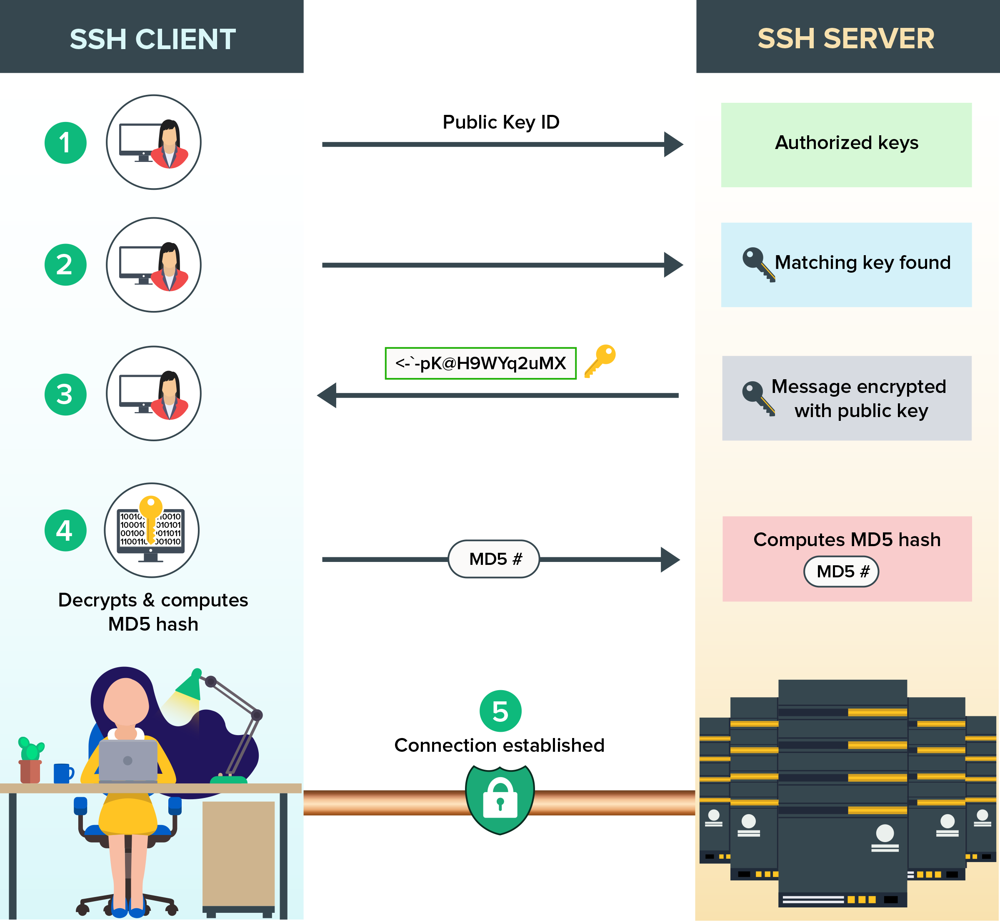

-------------------------------------------

Einführung von

- `wget, curl` in [Zugriff auf Webressourcen]
- `ssh` in [SSH Zugriff]
- `scp, rsync` in [Dateitransfer im Netz]


[Video: (en) Corey Schafer - How To Use The rsync Command - Sync Files Locally and Remotely [18 min]](https://www.youtube.com/watch?v=qE77MbDnljA) 

```{r, include=knitr::is_html_output(), echo=F}
knitr::asis_output('<a href="https://www.youtube.com/watch?v=qE77MbDnljA"
                   title="(en) Corey Schafer - How To Use The rsync Command - Sync Files Locally and Remotely [18 min]"
                   ></a>')
```


-------------------------------------------

# Zugriff auf Webressourcen

## Dateidownload

`wget` - expliziter Dateidownload ohne Logindaten

- "`-O`" (capital O!) = output = Name des Ausgabedatei (ansonsten Dateiname aus Link oder komplette URL als Dateiname)
- "`-i`" = input = alternative: Name einer Datei, die mehreren URLs von Zieldateien zum Download listet (dann keine URL in Aufruf angegeben)
- "`-c`" = continue = Download weiterführen (wenn zB. unterbrochen durch Netzwerkfehler, reboot, etc.)
- z.B. `wget https://avatars.githubusercontent.com/u/72390537 -O uni-palme.jpg`


## Formulare abfragen


`curl` - Abfrage von Formularergebnissen (Eingabemasken)

- [Hilfeseite](https://curl.se/docs/httpscripting.html)


-------------------------------------------

# SSH Zugriff

-------------------------------------------

## Verbindungsaufbau

- basiert auf **public-key Verschlüsselung**
  - dazu **zwei Schlüssel** nötig:
    - mit **public key** werden Daten **verschlüsselt**
    - mit **private key** werden verschlüsselte Daten **entschlüsselt**
- Verbindungsaufbau immer **zweischrittig**:
  - **(Schritt 1) Verschlüsselung herstellen** (analog zu HTTPS Verbindungsaufbau, s.o.)
    - Server schickt dazu seinen public key an Client
  - **(Schritt 2) Nutzer-Authentifizierung**
    - Client schickt dazu seinen public key an Server

**Einstiegsartikel: Wie funktioniert SSH?**

- (www) [Was sind **SSH Schlüssel** und wozu brauche ich sie?](https://web-development.github.io/git/public-private-key/)
- (www-en) [Was passiert beim Einloggen mittels **SSH Authentifizierung**?](https://www.manageengine.com/key-manager/information-center/what-is-ssh-key-management.html)
- (www) [HTTPS **Verschlüsselungsaufbau**](https://tiptopsecurity.com/how-does-https-work-rsa-encryption-explained/) = Schritt 1
- (www) [**Wozu** braucht man SSH Verbindungen?](https://www.ip-insider.de/was-ist-secure-shell-ssh-ssh-1-ssh-2-openssh-a-691217/)

Nachdem sie obige Artikel studiert haben, sollten sie den folgenden beiden zusammenfassenden Infografiken folgen können.

### 1 - Verschlüsselung

Schritt 1 - Herstellung einer verschlüsselten Verbindung (analog zu HTTPS Verbindungsaufbau)

[{width=50%}](remote/How-HTTPS-Works.png)

(Grafik von [tiptopsecurity.com](https://tiptopsecurity.com/how-does-https-work-rsa-encryption-explained/))

### 2 - Authentifizierung

Schritte einer Public Key Authentifizierung 

1. [einmalig] public key wird in "authorized_keys" im User account auf Server hinterlegt 
2. Verbindung wird initialisiert, dazu Nutzernamen und public key übermittelt. Server prüft, ob public key im "authorized_keys" file des Nutzers vorhanden. 
3. Wenn ja, Server verschlüsselt zufällige Nachricht mit dem public key und schickt diese an den User. 
4. User entschlüsselt Nachricht mit private key (nur damit möglich) und schickt diese (bzw. dessen MD5 sum) wieder an den Server. 
5. Wenn die originale Nachricht und die zurückgeschickte übereinstimmen, ist die Authentifizierung abgeschlossen und der Nutzer erhält Zugriff.

[{ width=70% }](remote/ssh-key-based-authentication_500_0.png)

(Grafik von [manageengine.com](https://www.manageengine.com/key-manager/information-center/what-is-ssh-key-management.html))

-------------------------------------------

## SSH Keys

- `ssh-keygen` = **generiert Schlüsselpaar** (private + public) und legt sie im `$HOME/.ssh` Verzeichnis ab
  - Fragen nach Schlüsselname und PassPhrase ggf. einfach mit Eingabetaste (keine Eingabe) bestätigen und (erstmal) Standardwert verwenden
- **Public key** (z.B. in `$HOME/.ssh/id_rsa.pub`) in der Datei `$HOME/.ssh/authorized_keys` **als neue Zeile** eintragen
  - z.B. via "`cat $HOME/.ssh/id_rsa.pub >> $HOME/.ssh/authorized_keys`"  (damit wird Zieldatei auch angelegt, wenn diese noch nicht vorhanden ist)

-------------------------------------------

## Lokaler SSH Server

- in Ubuntu:
  - prüfen ob am Laufen = `sudo service ssh status`
    - erstmal installieren, wenn nicht da = `sudo apt-get install openssh-server`
  - Server (neu) starten = `sudo service ssh restart`
    - falls die Fehlermeldung "`no hostkeys available`" erscheint, diese ggf. neu erzeugen via "`sudo ssh-keygen -A`"
  - Server stoppen = `sudo service ssh stop`

-------------------------------------------

## Verbindung herstellen

- `ssh` = SSH Client um Verbindung mit einem SSH Server aufzubauen
  - `ssh USERNAME@SERVERNAME`
    - `USERNAME` ist optional; wenn fehlend wird der eigene Benutzername der aktuellen shell genommen, von der der Aufruf kommt
    - `SERVERNAME` = IP (zB 192.168.1.32) oder Rechnername (herzblatt.gesucht.de)
- wenn:
  - lokaler SSH Server gestartet wurde (siehe oben)
  - SSH key pair generiert und unter Standardnamen im `.ssh` Verzeichnis abgelegt wurden
  - lokale `$HOME/.ssh/authorized_keys` Datei mit public key erweitert wurde
- dann funktioniert:
  - `ssh localhost` = **Verbindung zum eigenen Computer** (via SSH) :D
  - mit "`exit`" schliessen sie die Verbindung und kehren zur "ssh-aufrufenden Shell" zurück

-------------------------------------------

# Dateitransfer im Netz


-------------------------------------------

## Kopieren

`scp` - SSH-basierter cp-Befehl für Dateitransfer von und zu Servern

- `scp SOURCE TARGET`
  - `SOURCE` und `TARGET` können Serverangaben enthalten im Format: `USER@SERVER:FILEorFOLDER`
    - "`USER@`" - optionaler Nutzername, ansonsten eigener Nutzername verwendet
    - "`SERVER`:" - optionaler Servername (IP oder Adresse) im internen Netzwerk oder Internet; wenn nicht angegeben wird hier der eigene Rechner angenommen (`localhost`)
    - "`FILEorFOLDER`" - Name der Quell-/Zieldatei bzw. Verzeichnis
    - BEACHTEN: **absolute und relative Pfade** (bzgl. `$HOME` im remote server) möglich
  - `SOURCE` oder `TARGET` müssen auf anderem Server liegen, **nicht für lokales Kopieren** vorgesehen!
- ggf. Passwortabfrage (wenn SSH Server dies erlaubt)
- Wenn **pub-key Authentifizierung** eingerichtet ist (und der pub-key auf dem Server schon liegt), wird diese automatisch verwendet (keine Abfrage von login oder Passwort)
- "`-r`" - recursively - alle Unterverzeichnisse und -dateien werden entsprechend der wildcard-Angabe (mit `*` oder `?`) kopiert
- z.B. "`scp elrond@rivendell:missingRings.txt .`" holt die fehlende Liste zum Nachschauen ins aktuelle Verzeichnis (wenn die Authentifizierung klappt und der Server erreichbar ist)
    
    
-------------------------------------------

## Synchronisieren/Backup

`rsync` - Kopieren/Synchronisierung von Verzeichnissen für Archivierung und Spiegelung

- `rsync -a SOURCE TARGET`
  - `SOURCE` und `TARGET` **wie bei scp** definierbar
  - "`/`" **am Ende** von `SOURCE` = nur INHALT des Verzeichnisses synchronisieren (sonst auch Verzeichnisname im `TARGET` angelegt)
  - beide **können auf dem gleichen Rechner sein** (lokale Archivierung)
- **Standardverhalten** = alles was in `SOURCE` genannt ist (bzw. via wildcards gemappt wird) wird nach `TARGET` kopiert (und dortige Varianten ggf. ersetzt)
  - kann eingeschränkt werden auf
    - nur geänderte Dateien (neuer/grösser/kleiner)
    - fehlende Dateien/verzeichnisse
    - ... (siehe man page)
- "`-a`" = archiving = Dateirechte etc. bleiben erhalten, im Detail eine **Kombination von**
  - "`-t`" = timestamp = erhalte Zeitstempel
  - "`-r`" = recursive
  - "`-l`" = Links werden als solche kopiert (nicht deren Zieldatei)
  - "`-p`" = permissions erhalten
  - "`-g`" = group Rechte erhalten
  - "`-o`" = ownership erhalten
  - "`-D`" = special files erhalten
- "`-z`" = zip compressed = komprimierte Übertragung für schnelleren Synch von Text-basierten Dateien
- ("`-e ssh`") = execute ... = führt **SSH** für die Erstellung der remote Verbindung aus = **Standard bei neueren** rsync Versionen
- "`-nv`" = no execution + verbose = Testlauf um zu prüfen was wohin synchronisiert werden wird
- "`-u`" = update = nur neuere Dateien ersetzt
- "`-b`" = backup = ältere Dateien im Ziel werden umbenannt

### Achtung MacOs ...

MacOs User sollten ihre [rsync Version aktualisieren](https://www.geekbitzone.com/posts/rsync/upgrade-rsync-macos/), da die normal installierte Version aus lizenzrechtlichen Gründen veraltet ist!


-------------------------------------------

# > Tutorials <


Für einen besseren Überblick studieren sie doch bitte dieses

- [Online Tutorial zu rsync](https://www.digitalocean.com/community/tutorials/how-to-use-rsync-to-sync-local-and-remote-directories-de)
    


-------------------------------------------


```{r, include=knitr::is_html_output(), echo=F}
knitr::asis_output(paste('Download: <a href="remote.pdf" title="Download PDF Version">PDF Version</a> dieses Tutorials. Erstellt am ',format(Sys.time(), "%d.%m.%Y"),".",sep=""))
```

